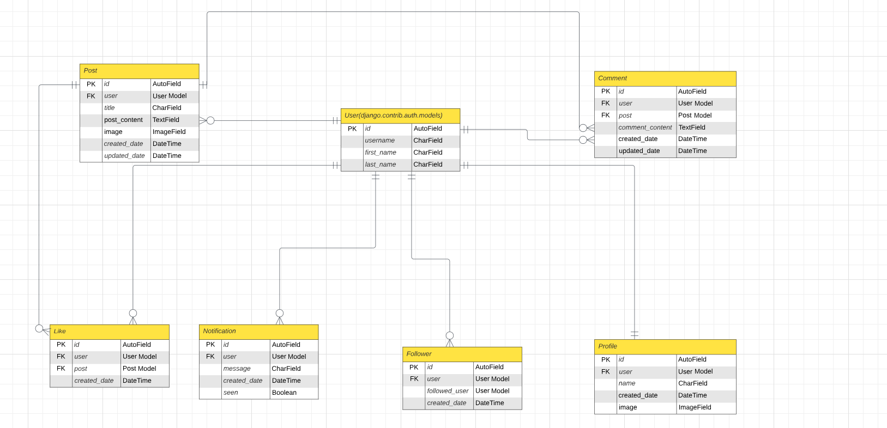

# Amebo_drf

## Project Goals

This project is the backend Django Rest Framework API for the [Amebo](https://github.com/sategie/Amebo) React frontend app.

It is designed to provide JSON data to the Amebo React web app.

## Data Models

An Entity Relationship Diagram (ERD) was created and it is used to show the relationships between the database models.

The relationships between the models are explained in terms of cardinality .i.e minimums and maximums .e.g What is the mimimum number of model A that can be associated with a single instance of model B, and what is the maximum number of model A that can be associated with a single instance of model B.

The cardinality is then reversed between model B and model A .i.e What is the minimum number of model B that can be associated with a single instance of model A, and what is the maximum number of model B that can be associated with a single instance of model A.

A total of 6 models were designed for this project (exluding the built-in User model which Django provides by default).

The custom models are explained below:

### **Profile**

This represents the profile of the user in the database.
If the user associated with the profile is deleted, the corresponding profile is also deleted.
This model has the following fields:

**user**: This has one to one relationship with the User model meaning that a user can only have one profile and one profile can only have one user

**name**: This represents the name of the user and can be left blank if no name is provided

**created_date**: A DateTime field showing when the profile was created

**image**: This represents the profile picture of the user. If no profile picture is uploaded, a default profile picture is used

### **Post**

This is the database model which stores the posts a user creates in the application.
If the user(author of the post) is deleted, so also are the posts associated with the user.
The model contains the following fields:

**user**: This has a foreign key relationship with the User model and represents the author of the post.

**title**: This represents the title of the post

**post_content**: This represents the content of the post

**image**: This is an image field which handles how/where images are stored in the database. This field is not compulsory when creating a post .i.e null = True

**created_date**: A DateTime field showing when the post was created

**updated_date**: A DateTime field showing when the post was updated

### **Comment**

This represents the comments on a particular post.
If the user who created the comment is deleted, so also is the comment of the user.
If the post associated with the comment is deleted, so also is the comment.
The model has the following fields:

**user**: This has a foreign key relationship with the User model and represents the author of the comment

**post**: This has a foreign key relationship with the Post model and represents the post which is commented on

**comment_content**: This is a Text field which represents the actual content of the comment

**created_date**: A DateTime field showing when the comment was created

**updated date**: A DateTime field showing when the comment was updated

### **Like**

This represents the likes of a particular post.
This model has the following fields:

**user**: This has a foreign key relationship with the User model

**post**: This has a foreign key relationship with the Post model

**created_date**: A DateTime field showing when the like occurred

### **Follower**

The follower model is used to represent the relationship when one user follows another user.
It is set up so that you are not able to follow the same person twice and if the user is deleted, the associated follow relationship is also removed.
This model has the following fields:

**user**: This has a foreign key relationship with the User model and is used to represent the followers of the logged in user

**followed_user**: This also has a foreign key relationship with the User model and is used to represent the users who the logged in user is following

**created_date**: A DateTime field showing when the follow occurred

### **Notification**

The notification model is used to store messages for users. If a user is deleted, so also is the notification.
Notifications are designed to be triggered when a user likes a post, comments on a post, follows another user or when a followed user posts new content.
This model has the following fields:

**user**: This has a foreign key relationship with the User model. It has a related name 'notifications' which is used to specify the name of the reverse relationship from the default User model back to the Notification model

**message**: The message field is a Charfield which stores the message content of the notification

**created_date**: This is a DateTime field which records the date and time the notification was created

**seen**: This is a Boolean field which changes from the default 'false' to 'true' when a user opens the specific notification

## API Endpoints

| **PROFILES**      |                    |                                          |             |
| ----------------- | ------------------ | ---------------------------------------- | ----------- |
| HTTP              | URI                | CRUD OPERATION                           | VIEW NAME   |
| GET               | /profiles          | List all profiles                        | List View   |
|                   |                    |                                          |             |
| GET               | /profiles/:id      | Get a specific profile by its ID         | Detail View |
| PUT               | /profiles/:id      | Edit a specific profile by its ID        | Detail View |
|                   |                    |                                          |             |
| **POSTS**         |                    |                                          |             |
| HTTP              | URI                | CRUD OPERATION                           | VIEW NAME   |
| GET               | /posts             | List all posts                           | List View   |
| POST              | /posts             | Create new post                          | List View   |
|                   |                    |                                          |             |
| GET               | /posts/:id         | Get a specific post by its ID            | Detail View |
| PUT               | /posts/:id         | Edit a specific post by its ID           | Detail View |
| DELETE            | /posts/:id         | Delete a specific post by its ID         | Detail View |
|                   |                    |                                          |             |
| **COMMENTS**      |                    |                                          |             |
| HTTP              | URI                | CRUD OPERATION                           | VIEW NAME   |
| GET               | /comments          | List all comments                        | List View   |
| POST              | /comments          | Create new comment                       | List View   |
|                   |                    |                                          |             |
| GET               | /comments/:id      | Get a specific comment by its ID         | Detail View |
| PUT               | /comments/:id      | Edit a specific comment by its ID        | Detail View |
| DELETE            | /comments/:id      | Delete a specific comment by its ID      | Detail View |
|                   |                    |                                          |             |
| **LIKES**         |                    |                                          |             |
| HTTP              | URI                | CRUD OPERATION                           | VIEW NAME   |
| GET               | /likes             | List all likes                           | List View   |
| POST              | /likes             | Create new like                          | List View   |
|                   |                    |                                          |             |
| GET               | /likes/:id         | Get a specific like by its ID            | Detail View |
| PUT               | /likes/:id         | Edit a specific like by its ID           | Detail View |
| DELETE            | /likes/:id         | Delete a specific like by its ID         | Detail View |
|                   |                    |                                          |             |
| **FOLLOWERS**     |                    |                                          |             |
| HTTP              | URI                | CRUD OPERATION                           | VIEW NAME   |
| GET               | /followers         | List all followers                       | List View   |
| POST              | /followers         | Create new follower                      | List View   |
|                   |                    |                                          |             |
| GET               | /followers/:id     | Get a specific follower by its ID        | Detail View |
| DELETE            | /followers/:id     | Delete a specific follower by its ID     | Detail View |
|                   |                    |                                          |             |
| **NOTIFICATIONS** |                    |                                          |             |
| HTTP              | URI                | CRUD OPERATION                           | VIEW NAME   |
| GET               | /notifications     | List all notifications                   | List View   |
|                   |                    |                                          |             |
| GET               | /notifications/:id | Get a specific notification by its ID    | Detail View |
| DELETE            | /notifications/:id | Delete a specific notification by its ID | Detail View |

## Technologies Used

The Amebo-drf API was created using [Django](https://www.djangoproject.com) and [Django Rest Framework](https://django-filter.readthedocs.io/en/stable/).

### Frameworks, Libraries and Dependencies

#### django-cloudinary-storage

https://pypi.org/project/django-cloudinary-storage/

Used to enable the storage of images on the Cloudinary platform

#### dj-allauth

https://django-allauth.readthedocs.io/en/latest/

This is used for user authentication.

#### dj-rest-auth

https://dj-rest-auth.readthedocs.io/en/latest/introduction.html

This provides REST API endpoints for login and logout functionality. This is not shown in the deployed backend API, because the functionality is implemented from the frontend Amebo React Web app.

#### djangorestframework-simplejwt

https://django-rest-framework-simplejwt.readthedocs.io/en/latest/

Provides JSON web token authentication.

#### dj-database-url

https://pypi.org/project/dj-database-url/

Creates an environment variable to for the database configuration.

#### psycopg2

https://pypi.org/project/psycopg2/

This enables the interaction between Python and the PostgreSQL database.

#### django-filter

https://django-filter.readthedocs.io/en/stable/

This is used to create filters in the resource views

#### django-cors-headers

https://pypi.org/project/django-cors-headers/

This Django app adds Cross-Origin-Resource Sharing (CORS) headers to responses. It enables the API to respond to requests from origins other than its own host.

### Third Party Software

#### Cloudinary

https://cloudinary.com/

This is used to store the uploaded images in the project

#### ElephantSQL

https://www.elephantsql.com/

This is used to manage the PostgreSQL database used in the project

#### Heroku

https://www.heroku.com/

This is used to host the deployed application

## Manual Testing

| RESOURCE          | TEST                       | TEST ACTION                                                                                                                  | EXPECTED OUTCOME                                                                                               | RESULT |
| ----------------- | -------------------------- | ---------------------------------------------------------------------------------------------------------------------------- | -------------------------------------------------------------------------------------------------------------- | ------ |
| **POSTS**         | CRUD Post                  | User accesses posts resource without authenticating                                                                          | User can read post, but has no option to create, update or delete a post                                       | PASS   |
|                   |                            | User accesses posts resource after authenticating                                                                            | User can read a post, create, update and delete a post                                                         | PASS   |
|                   |                            |                                                                                                                              |                                                                                                                |        |
|                   | Duplicate Title            | User attempts to create a post with the same title as another post already created by the user                               | A new post is not created. The following message appears: "You already have an existing post with this title." | PASS   |
|                   |                            | User attempts to create a post with the same title as another post already created by the same user (using a different case) | A new post is not created. The following message appears: "You already have an existing post with this title." | PASS   |
|                   |                            | User attempts to create a post with the same title as another post created by another user                                   | A new post is created as the duplicate title check is only attributed to a specific user                       | PASS   |
|                   |                            |                                                                                                                              |                                                                                                                |        |
| **COMMENTS**      | CRUD Comment               | User accesses comments resource without authenticating                                                                       | User can read post comments, but has no option to create, update or delete a comment                           | PASS   |
|                   |                            | User accesses comments resource after authenticating                                                                         | User can read post comments, create, update or delete their created comment                                    | PASS   |
|                   |                            |                                                                                                                              |                                                                                                                |        |
|                   | Comments Count             | User comments on a post                                                                                                      | The comments count on the post is increased by 1                                                               | PASS   |
|                   |                            |                                                                                                                              |                                                                                                                |        |
| **LIKES**         | CRUD Like                  | User accesses likes resource without authenticating                                                                          | User can view post likes, but has no option to create or delete a like                                         | PASS   |
|                   |                            | User accesses likes resource after authenticating                                                                            | User can view post likes and can also create a new like or delete(unlike) the post                             | PASS   |
|                   |                            |                                                                                                                              |                                                                                                                |        |
|                   | Duplicate Like             | A user attempts to like a post they have already liked                                                                       | A message appears informing that the user has already liked the post                                           | PASS   |
|                   |                            |                                                                                                                              |                                                                                                                |        |
|                   | Likes Count                | User likes a post                                                                                                            | The likes count on the post is increased by 1                                                                  | PASS   |
|                   |                            | User unlikes a post                                                                                                          | The likes count on the post is decreased by 1                                                                  | PASS   |
|                   |                            |                                                                                                                              |                                                                                                                |        |
| **PROFILES**      | Read/Update/Delete Profile | User accesses the profiles resource without authenticating                                                                   | User can view the profile, but has no option to update or delete a profile                                     | PASS   |
|                   |                            | User accesses the profiles resource after authenticating                                                                     | User can view the profile, update(Name/Image) or delete their own profile                                      | PASS   |
|                   |                            |                                                                                                                              |                                                                                                                |        |
| **FOLLOWERS**     | CRUD Follower              | User accesses the followers resource without authenticating                                                                  | The user is prompted to authenticate to view follower list                                                     | PASS   |
|                   |                            | User accesses the followers resource after authenticating                                                                    | User can view followed users, follow/unfollow a user                                                           | PASS   |
|                   |                            |                                                                                                                              |                                                                                                                |        |
|                   | Follow User                | User attempts to follow oneself                                                                                              | User cannot follow oneself. The following message appears "You cannot follow yourself"                         | PASS   |
|                   | Duplicate Follow           | User attempts to follow a user they are already following                                                                    | The action is not completed. The following message appears "You are already following this user"               | PASS   |
|                   |                            |                                                                                                                              |                                                                                                                |        |
| **NOTIFICATIONS** | Read/Delete Notification   | User accesses the notifications resource without authenticating                                                              | The user is prompted to authenticate before being able to view notifications                                   | PASS   |
|                   |                            | User access the notifications resource after authenticating                                                                  | The user can view their notifications and can also delete a notification                                       | PASS   |
|                   |                            |                                                                                                                              |                                                                                                                |        |
|                   | Seen/Unseen Notifications  | User opens the notification list                                                                                             | The unread notifications are marked as not seen                                                                | PASS   |
|                   |                            | User opens a notification detail (Clicks on a particular notification)                                                       | The specific notification is marked as seen                                                                    | PASS   |
|                   |                            |                                                                                                                              |                                                                                                                |        |
|                   | Notifications: Likes       | A like is made on the user's post                                                                                            | The user receives a notification of the new like                                                               | PASS   |
|                   |                            |                                                                                                                              |                                                                                                                |        |
|                   | Notifications: Follow      | A new follower event occurs                                                                                                  | The user receives a notification of the new follower                                                           | PASS   |
|                   |                            |                                                                                                                              |                                                                                                                |        |
|                   | Notifications: New Comment | A new comment is made on the user's post                                                                                     | The user receives a notification of the new comment                                                            | PASS   |
|                   |                            |                                                                                                                              |                                                                                                                |        |
|                   | Notifications: New Post    | The logged in user posts a new content                                                                                       | The followers of the logged in user who posted the content, get notifications that a new post was created      | PASS   |

### Known Bugs

There are currently no known bugs in the API.

## Validation

The Python code used in the project was validated using the [Code Institute Python Linter](https://pep8ci.herokuapp.com/):

Some lines exceeded the 79 character per line guideline, but these were corrected.

No errors were found after the necessary corrections were made.

## Deployment

The Amebo_drf API is deployed to Heroku, using an ElephantSQL Postgres database.
The deployment steps are as follows:

- Login to Cloudinary.
- Select the 'dashboard' option.
- Copy the value of the 'API Environment variable' starting from `cloudinary://`.
- Log in to Heroku.
- Select 'Create new app' from the 'New' menu at the top right.
- Enter a name for the app and select the appropriate region.
- Select 'Create app'.
- Select 'Settings' from the menu at the top.
- Login to ElephantSQL.
- Click 'Create new instance' on the dashboard.
- Name the 'plan' and select the 'Tiny Turtle (free)' plan (or any other paid plans).
- Choose 'select region'.
- Choose the nearest data centre to your location.
- Click 'Review'.
- Go to the ElephantSQL dashboard and click on the 'database instance name' for this project.
- Copy the ElephantSQL database URL to your clipboard (starts with `postgres://`).
- Return to the Heroku dashboard.
- Select the 'settings' tab.
- Click the 'reveal config vars' option
- Enter the following config var names and values:
  - `CLOUDINARY_URL`: _your cloudinary URL as obtained above_
  - `DATABASE_URL`: _your ElephantSQL postgres database URL as obtained above_
  - `SECRET_KEY`: _your secret key_
  - `ALLOWED_HOST`: _the url of your Heroku app (but without the `https://`)_
- Select the 'Deploy' tab at the top.
- Select 'GitHub' from the deployment options and confirm you wish to deploy using GitHub.
- Find the 'Connect to GitHub' section and use the search box to locate and connect to your repo.
- You may choose to automatically deploy your API each time you commit and push to Github
- Find the 'Manual Deploy' section, choose 'main' as the branch to deploy and select 'Deploy Branch'.
- Your API will be deployed after the build is successful

### How to Fork the Repository

- You can make a copy of the project by doing the following:

    1. Go to the project's Github repository: [Amebo_drf](https://github.com/sategie/amebo_drf)

    2. Click on the *Fork* button on the top right of the screen.

- Note: Changes made here do not affect the original repository

### How to Clone the Repository

- The repository can be cloned by doing the following:

    1. Go to the project's Github repository: [Amebo_drf](https://github.com/sategie/amebo_drf)

    2. Click the green *Code* button on the right.

    3. Click on *HTTPS* and copy the link.

    4. Open Git and change the working directory to where you want to have the cloned directory.

    5. Type *git clone* and paste the copied URL.

- You can make changes to the project by doing the following:

    1. Type *git add .*

    2. Type *git commit -m* and add a short comment within quotes .e.g git commit -m "This is a short comment example"

    3. Type *git push* to push the changes to the repository

- Note: Any update committed to the main branch immediately reflects in the hosted site.

## Credits

- The idea for some of the resources used in the project was inspired by Code Institute's drf-API walkthrough project.
